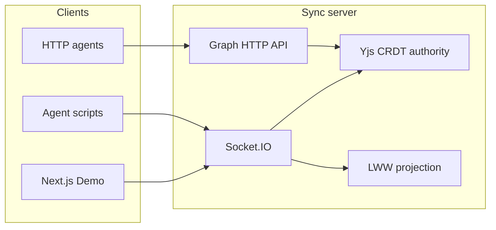

# Slisync

**Realtime shared-memory sync for multi-agent rooms** (optional export to [Aonote](https://aonote.vercel.app))

[中文](./README.zh-CN.md) · [GitHub](https://github.com/runsli/slisync) · [slisync.com](https://slisync.com)

> **Sli** = *scoped live information* in a room — layered memory merged via CRDT.  
> Reference implementation: [docs/en/VISION.md](./docs/en/VISION.md).

---

## What is it?

Not a chat app, not Web3, not a thin wrapper.

**Slisync** is an **AI-native realtime sync engine** so agents share memory, state, and context in a **room**, then publish to Aonote. Transport: **Socket.IO + Yjs CRDT** (optional LWW + JSON Patch). Agents write via Socket or HTTP.

| Package | Role |
|---------|------|
| `@slisync/sync-schema` | Graph types, `GraphOp`, auth, protocol version |
| `@slisync/sync-sdk` | Client hooks, Zustand, CRDT/LWW, `MemoryGraph` |
| `@slisync/sync-server` | Socket server, persistence, Graph HTTP, Presence |

---

## Why it matters

1. **Forget-after-chat** — one room-level memory, not per-agent silos.
2. **Multi-agent work** — planning / coding / testing agents read and write the same space.

Details: [docs/en/VISION.md](./docs/en/VISION.md#2-why-it-matters).

---

## Roadmap

12-phase product vision vs implementation: [docs/en/ROADMAP.md](./docs/en/ROADMAP.md) · Aonote export: [docs/en/export.md](./docs/en/export.md)

| Vision | Theme | This repo |
|--------|-------|-----------|
| 1–3 | Realtime / local-first / patch | ✅ realtime + patch; 🟡 offline outbox (no IndexedDB yet) |
| 4–6 | Persistence / CRDT / SDK | ✅ |
| 7–8 | Memory layer / graph | 🟡 structured chunks; ✅ graph + HTTP |
| 9 | Semantic search | ⛔ excluded |
| 10–12 | Multi-agent / workflow / AI OS | 🟡 agent + presence; ⬜ workflow & OS |

Engineering phases 1–11, P0–P3: [packages/README.md](./packages/README.md#engineering-phases).

---

## Quick start

Requires **Node ≥ 20.9**.

```bash
nvm use 20
npm install
npm run dev
```

Open [http://localhost:3000](http://localhost:3000).

Demo: **CRDT / LWW** comparison, shared `message`/`counter`, Memory Graph (tree / force-directed), workspace/session/chunk, Presence, offline queue, agent/graph toasts.

Standalone sync server:

```bash
npm run sync:server          # :3001
NEXT_PUBLIC_SYNC_URL=http://localhost:3001 npm run dev
```

### SDK sketch

```ts
import { useSync, MemoryGraph, createSyncStore } from "@slisync/sync-sdk";

const store = createSyncStore({ message: "Hello", counter: 0 });
const { patchData, syncReady, getCrdtDocument } = useSync({
  roomId: "my-project",
  defaultState: { message: "Hello", counter: 0 },
  strategy: "crdt",
  store,
});

patchData({ message: "Stripe integration in progress" });

const doc = getCrdtDocument();
if (doc && syncReady) {
  MemoryGraph.on(doc, "agent-1")
    .init("my-project")
    .upsertChunk({
      workspaceId: "ws-main",
      title: "Payment notes",
      content: "Use Stripe Checkout.",
    });
}
```

---

## Architecture



`npm run dev` serves UI + sync on **:3000** via a custom Next server.

---

## Commands

| Command | Description |
|---------|-------------|
| `npm run dev` | Next + embedded sync (:3000) |
| `npm run sync:server` | Sync only (:3001) |
| `npm run sync:reset` | Clear local persistence |
| `npm run agent:push` | Socket agent write |
| `npm run graph:seed` | Agent seeds scoped graph (default) |
| `npm run graph:push:http` | HTTP graph ops |
| `npm run graph:traverse:http` | HTTP graph traverse |
| `npm test` | Integration tests (24 cases) |
| `npm run test:cluster` | Two instances + Redis (`REDIS_URL`) |
| `npm run build:packages` | Build `dist/` for npm publish |

Environment: [.env.example](./.env.example)

---

## Layout

```text
slisync/
├── app/ src/              # Next.js Demo
├── server.ts              # Custom server (sync mounted)
├── packages/
│   ├── sync-schema/
│   ├── sync-sdk/
│   └── sync-server/
├── docs/
│   ├── en/                # English (default)
│   └── zh/                # 中文
├── scripts/
└── tests/integration/
```

---

## Principles

- **Local-first direction** — offline outbox shipped; IndexedDB planned.
- **Simple API** — Demo in minutes.
- **Stability** — protocol version, CRDT authority, reconnect, tests.
- **Out of scope** — Web3, chat super-app, vectors / embeddings / reasoning.

---

## Documentation

| Doc | Language |
|-----|----------|
| [docs/en/VISION.md](./docs/en/VISION.md) | English |
| [docs/zh/VISION.md](./docs/zh/VISION.md) | 中文 |
| [docs/en/ROADMAP.md](./docs/en/ROADMAP.md) | English |
| [docs/zh/ROADMAP.md](./docs/zh/ROADMAP.md) | 中文 |
| [docs/en/export.md](./docs/en/export.md) | English |
| [docs/zh/export.md](./docs/zh/export.md) | 中文 |
| [packages/README.md](./packages/README.md) | English (technical) |
| [packages/README.zh-CN.md](./packages/README.zh-CN.md) | 中文（技术） |
| [docs/README.md](./docs/README.md) | Index |

---

## Tests

```bash
npm test
```

In-process ephemeral server: CRDT, HTTP graph, auth, presence, capabilities, offline outbox, etc.

---

## Stack

Next.js · TypeScript · Tailwind · Zustand · Socket.IO · Yjs · Redis (optional) · Node.js

Future: WebRTC, PostgreSQL, IndexedDB — [docs/en/ROADMAP.md](./docs/en/ROADMAP.md).
