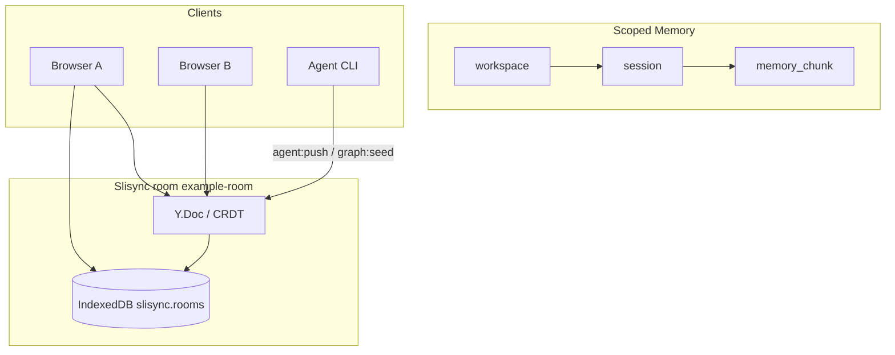

# Demo: scoped memory first

[中文](../zh/demo-scoped-memory.md)

This guide covers the **primary Slisync reference Demo path**: edit `workspace → session → memory_chunk` in one room with Presence, Agent CLI, and local-first persistence. Legacy `message` / `counter` fields are collapsed for comparison only.

See also: [local-first.md](./local-first.md) · [export.md](./export.md) · [ROADMAP.md](./ROADMAP.md)

---

## Data flow



---

## Prerequisites

- **Node ≥ 20.9** (`nvm use 20`; `.nvmrc` at repo root)
- Terminal 1:

```bash
cd /path/to/infra
nvm use 20
npm install
npm run dev
```

- Wait for `> Local: http://localhost:3000` before opening the browser.
- Default room: `example-room`; default scope: `ws-demo` / `sess-demo` (same as `npm run graph:seed`).

---

## Five-minute manual checklist

| Step | Action | Expected |
|------|--------|----------|
| 1 | Open [http://localhost:3000](http://localhost:3000), keep **CRDT** | Main panel is **Scoped Memory**; graph left, chunk editor right |
| 2 | Wait for `connected` / `syncReady` | Empty room **auto-seeds** demo graph once per browser session, or click **初始化演示工作区** |
| 3 | Edit a **memory_chunk** title or body on the right | Local UI updates; scope bar shows workspace / session |
| 4 | Open a second browser window on the same URL | Chunk content merges within seconds; scope bar shows **2** online |
| 5 | In terminal 2, run **agent:push** below | Agent toasts at top and inside scoped memory panel |
| 6 | DevTools → **Offline**, edit chunk → hard refresh → online | Edits survive ([local-first.md](./local-first.md)); use **clear local cache** to reset |

**Note:** `message` / `counter` live under collapsed **legacy shared fields**, not the main narrative.

---

## CLI aligned with Demo

With **`npm run dev` running**, open terminal 2:

```bash
npm run graph:seed

npm run agent:push -- --action summarize --append " [from agent]"
```

The Demo footer includes a **copy** button for the same `agent:push` command. `graph:seed` uses `buildScopedMemoryOps(AGENT_ID, "ws-demo", "sess-demo")`.

Export snapshot (**not** from IndexedDB yet — follow-up):

```bash
npm run export:chunks
```

Details: [export.md](./export.md).

---

## UI phases (0–3)

| Phase | Demo behavior |
|-------|----------------|
| 0 | Memory Graph first; legacy fields collapsed; LWW under **Advanced** |
| 1 | Scope picker + two-column layout |
| 2 | One-time auto-seed; dismissible welcome strip |
| 3 | Presence in scope bar; Chinese activity toasts; in-panel Agent highlight |

---

## Troubleshooting

| Symptom | Fix |
|---------|-----|
| Browser spins forever | Ensure `npm run dev` printed `Listen on`; `npm run dev:stop` then restart; `node -v` must be v20.x |
| No auto-seed | Session already seeded (`sessionStorage`) or room has nodes; use manual seed button |
| Online count 0 | Wait for Presence after `connected` |
| agent:push fails | Start `npm run dev` first; read CLI error and connection banner |

---

## Related

- [local-first.md](./local-first.md)
- [export.md](./export.md)
- [VISION.md](./VISION.md)
- [packages/README.md](../../packages/README.md)
