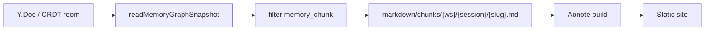

# Aonote export (Memory Chunk → Markdown)

[中文](../zh/export.md)

Slisync exports **`memory_chunk`** nodes from a room’s Memory Graph as Markdown with YAML front matter, for static site builders such as [Aonote](https://aonote.vercel.app).

**v1**: one-way snapshot export only — **no** Markdown → CRDT round-trip.

---

## Data flow



| Milestone | Location | Role |
|-----------|----------|------|
| M0 | This doc | Paths and acceptance |
| M1 | `@slisync/sync-sdk` `export-chunks.ts` | Snapshot / update → in-memory files |
| M2 | `npm run export:chunks` | Read CRDT JSON (local or fixture), write disk |
| M3 | HTTP GET | [export-http.md](./export-http.md) (Phase 0 contract; handler in Phase 1) |
| M4 | Optional PostgreSQL CRDT persistence | [export-http.md](./export-http.md#persistence-design-pre-implementation) |
| M3+ | Aonote repo wiring | Consume Markdown in the Aonote repo |

---

## Layout (Aonote-aligned)

Default output root: `markdown/chunks/` (override with `--out`).

```
markdown/chunks/
  {workspaceId}/
    {sessionId}/
      {slug}.md
```

- `workspaceId` / `sessionId` come from `data.scope` on the chunk.
- Missing `sessionId` → `_unsessioned`.
- `slug` from node `title`; non-Latin titles fall back to a `nodeId` prefix.

---

## File format

YAML front matter + body (`content`):

```yaml
---
title: "User asked about CRDT sync"
date: "2026-05-20T12:00:00.000Z"
workspaceId: ws-demo
sessionId: sess-demo
nodeId: node_xxx
kind: memory_chunk
roomId: example-room
source: chat
importance: 0.9
tags: [scope:chunk]
---

Explain Yjs merge vs LWW optimistic locking for shared memory.
```

---

## SDK (M1)

```ts
import {
  exportMemoryChunksFromSnapshot,
  exportMemoryChunksFromCrdtUpdate,
  exportMemoryChunksFromCrdtFile,
} from "@slisync/sync-sdk/graph";

const files = exportMemoryChunksFromSnapshot(snapshot, { roomId: "my-room" });
const fromUpdate = exportMemoryChunksFromCrdtUpdate(update, { roomId: "my-room" });
const fromDisk = await exportMemoryChunksFromCrdtFile(
  ".sync-data/crdt-rooms.json",
  "example-room",
);
```

Each `ExportedChunkFile` has `relativePath` and full `markdown`; callers write to disk.

---

## CLI (M2)

### CRDT data source (auto-resolve)

Without `SYNC_CRDT_DATA_PATH`:

| Condition | File used |
|-----------|-----------|
| `SYNC_CRDT_DATA_PATH` set | That path |
| `CI` or `GITHUB_ACTIONS` (fixture exists) | `fixtures/crdt-rooms.example.json` |
| `.sync-data/crdt-rooms.json` exists | Local dev/seed persistence |
| Otherwise | `fixtures/crdt-rooms.example.json` |

Committed **`fixtures/crdt-rooms.example.json`** holds only `example-room` (~6KB) for reproducible export without a running server.

| Env | Default |
|-----|---------|
| `SYNC_CRDT_DATA_PATH` | (auto-resolve above) |
| `SYNC_ROOM` | `example-room` if `--room` omitted |

**Path A — live room:**

```bash
npm run dev
npm run graph:seed
npm run export:chunks -- --room example-room --out ./markdown/chunks
```

**Path B — fixture (CI / fresh clone):**

```bash
npm run export:chunks:ci -- --out ./markdown/chunks
```

**Refresh fixture** after changing demo graph ops:

```bash
npm run dev && npm run graph:seed
npm run fixtures:refresh
```

Filters: `SYNC_EXPORT_WORKSPACE`, `SYNC_EXPORT_SESSION`, `SYNC_EXPORT_MIN_IMPORTANCE`.

---

## Acceptance

**Local:** `graph:seed` → `export:chunks` → ≥2 `.md` under `markdown/chunks/`.

**CI:** `npm run export:chunks:ci` uses the fixture; the `CI` GitHub workflow runs the same step.

Copy into an Aonote project and build. Tests: `tests/unit/export-chunks.test.ts`. Generated `markdown/chunks/` is gitignored.

---

## Out of scope

- Write-back from edited Markdown
- IndexedDB as HTTP export source
- HTTP export of `task` and other non-`memory_chunk` nodes

HTTP export contract and acceptance chain: [export-http.md](./export-http.md). See [ROADMAP.md](./ROADMAP.md) · [VISION.md](./VISION.md).
