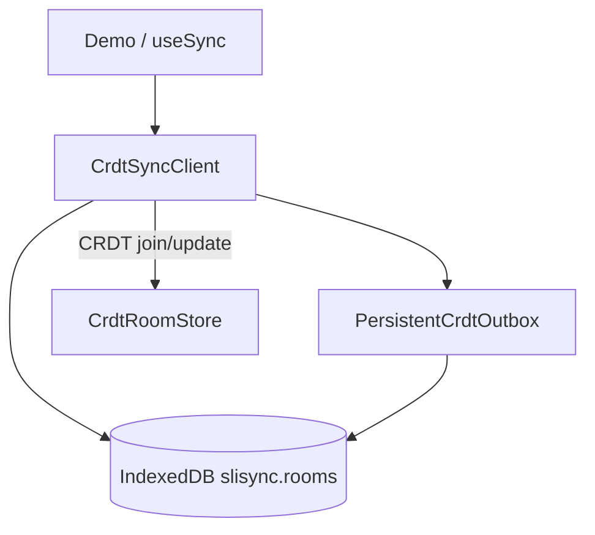

# Local-first

[中文](../zh/local-first.md)

The browser persists each CRDT **room** in **IndexedDB**: after refresh or brief offline edits, the client restores the local `Y.Doc` and outbound queue, then merges with server CRDT when online. **The server remains merge authority.**

## Architecture



## `useSync` fields

```ts
const {
  patchData,
  outboxSize,
  localRestored,
  lastSyncedAt,
} = useSync({
  roomId: "example-room",
  defaultState: { message: "Hello", counter: 0 },
  strategy: "crdt",
  localPersistence: true,
});
```

| Field | Meaning |
|-------|---------|
| `localPersistence` | Use IndexedDB |
| `localRestored` | `null` before hydrate; `true` if local snapshot applied |
| `lastSyncedAt` | Last successful server sync (Unix ms) |
| `outboxSize` | Pending upload queue length |

Clear local: `clearLocalRoom(roomId)`.

## Export relationship

::: warning
**export:chunks** reads **server** CRDT persistence, not IndexedDB. Local-only edits **will not** appear in export.
:::

See [Export Markdown](./export.md).
