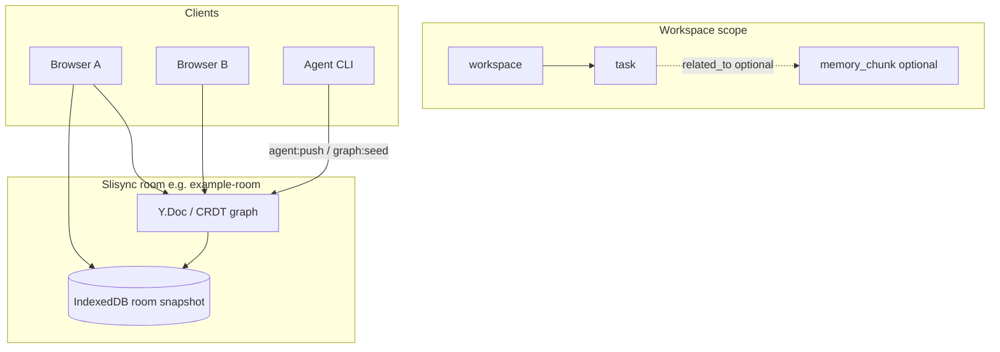

# Room task bus (Phase 0)

[中文](../zh/task-bus.md)

This document defines the **graph-native task model** for Slisync rooms: authoritative task state lives in the shared Memory Graph as `kind: "task"` nodes, not in a separate IndexedDB task table or new socket events.

Related: [demo-scoped-memory.md](./demo-scoped-memory.md) · [local-first.md](./local-first.md) · [packages/README.md](../../packages/README.md)

---

## Data flow



Tasks are **nodes** in the same CRDT-backed graph as scoped memory. Clients and agents mutate them via existing graph ops (`upsertNode`, `upsertEdge`) inside `agent:push` or room CRDT updates — **no** `sync:task-*` socket events in Phase 0.

---

## Task vs scoped memory

| Aspect | `memory_chunk` (scoped memory) | `task` (task bus) |
|--------|-------------------------------|-------------------|
| Purpose | Durable AI/user notes per workspace/session | Actionable work items (status, assignee, due date) |
| Primary `data` | `content`, `importance`, `scope` | `status`, `scope`, optional `assigneeId`, `priority`, `dueAt` |
| Typical edges | `contains` from session | `depends_on`, `assigned_to`, optional `related_to` → chunk |
| Parser | `parseMemoryChunkData` | `parseTaskData` |

A task may link to a memory chunk with **`related_to`** when context should stay in the chunk body but the task tracks execution (Phase 0 documents the pattern; `MemoryGraph.upsertTask` arrives in Phase 1).

---

## `TaskData` (schema)

Types live in `@slisync/sync-schema` (`task-model.ts`):

| Field | Type | Required |
|-------|------|----------|
| `scope` | `MemoryScope` (`workspaceId`, optional `sessionId`) | yes |
| `status` | `todo` \| `in_progress` \| `blocked` \| `done` \| `cancelled` | yes |
| `assigneeId` | string | no |
| `priority` | number | no |
| `dueAt` | ISO-8601 string | no |
| `source` | string (e.g. `agent:push`) | no |

Example node payload:

```json
{
  "kind": "task",
  "title": "Review scoped memory export",
  "data": {
    "scope": { "workspaceId": "ws-demo", "sessionId": "sess-demo" },
    "status": "todo",
    "priority": 1,
    "source": "agent:push"
  }
}
```

---

## Agent graph policy (default)

`DEFAULT_AGENT_GRAPH_POLICY` allows:

- **Node kinds:** includes `task`
- **Relations:** includes `depends_on`, `assigned_to` (plus `contains`, `related_to`, …)
- **Ops:** `upsertNode`, `upsertEdge`, `addTag`, `addRef`

Inspect defaults:

```bash
npm run graph:policy
```

---

## CLI (unchanged protocol)

With `npm run dev` running:

```bash
npm run graph:seed
npm run agent:push -- --action summarize --append " [from agent]"
```

Scoped memory seeding is documented in [demo-scoped-memory.md](./demo-scoped-memory.md). Task nodes will be seeded/updated through the same graph op path in later phases; Phase 0 only ships types, parsers, and policy defaults.

---

## Phase 0 scope

| In scope | Out of scope |
|----------|--------------|
| `TaskStatus`, `TaskData`, `parseTaskData` | `MemoryGraph.upsertTask` helper |
| Design docs (this file) | Demo UI for tasks |
| Default agent policy for `task` / `depends_on` / `assigned_to` | `sync:task-*` socket events |
| Unit tests for parsing | IndexedDB-only task tables |

---

## Related links

- [demo-scoped-memory.md](./demo-scoped-memory.md) — workspace → session → memory_chunk demo
- [local-first.md](./local-first.md) — CRDT + IndexedDB room persistence (not a task store)
- [ROADMAP.md](./ROADMAP.md) — delivery phases
