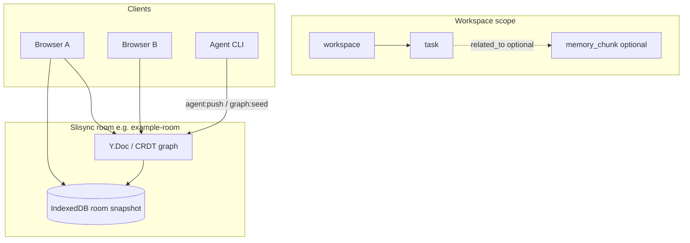

# Room task bus

[中文](../zh/task-bus.md)

Slisync **room-level, graph-native** task bus: authoritative task state lives in the shared Memory Graph as `kind: "task"` nodes, on the same `Y.Doc` / CRDT path as scoped memory.

Related: [demo-scoped-memory.md](./demo-scoped-memory.md) (Memory tab) · [local-first.md](./local-first.md) · [ROADMAP.md](./ROADMAP.md) · [packages/README.md](../../packages/README.md)

---

## Data flow



Tasks are **nodes** in the same CRDT-backed graph as scoped memory. Clients and agents mutate them via existing graph ops (`upsertNode`, `upsertEdge`) inside `agent:push` or room CRDT updates — **no** `sync:task-*` socket events in Phase 0.

---

## Task vs scoped memory

| Aspect | `memory_chunk` (scoped memory) | `task` (task bus) |
|--------|-------------------------------|-------------------|
| Purpose | Durable AI/user notes per workspace/session | Actionable work items (status, assignee, due date) |
| Primary `data` | `content`, `importance`, `scope` | `status`, `scope`, optional `assigneeId`, `priority`, `dueAt` |
| Typical edges | `contains` from session | `depends_on`, `assigned_to`, optional `related_to` → chunk |
| Parser | `parseMemoryChunkData` | `parseTaskData` |

A task may link to a memory chunk with **`related_to`** when context should stay in the chunk body but the task tracks execution.

---

## `TaskData` (schema)

Types live in `@slisync/sync-schema` (`task-model.ts`):

| Field | Type | Required |
|-------|------|----------|
| `scope` | `MemoryScope` (`workspaceId`, optional `sessionId`) | yes |
| `status` | `todo` \| `in_progress` \| `blocked` \| `done` \| `cancelled` | yes |
| `assigneeId` | string | no |
| `priority` | number | no |
| `dueAt` | ISO-8601 string | no |
| `source` | string (e.g. `agent:push`) | no |

Example node payload:

```json
{
  "kind": "task",
  "title": "Review scoped memory export",
  "data": {
    "scope": { "workspaceId": "ws-demo", "sessionId": "sess-demo" },
    "status": "todo",
    "priority": 1,
    "source": "agent:push"
  }
}
```

---

## SDK (Phase 1)

Exports from `@slisync/sync-sdk` / `@slisync/sync-sdk/graph`:

| API | Role |
|-----|------|
| `MemoryGraph.upsertTask` | Create or update a `kind: "task"` node on the room `Y.Doc` |
| `MemoryGraph.updateTaskStatus` | Change `status` and optional fields on an existing task |
| `filterTasksByScope` | Filter snapshot nodes to tasks matching `workspaceId` / `sessionId` |
| `buildDemoTaskOps` | Seed ops: workspace/session + 3 Chinese demo tasks + `contains` / `depends_on` / `assigned_to` |

```ts
import * as Y from "yjs";
import {
  applyGraphOps,
  buildDemoTaskOps,
  filterTasksByScope,
  MemoryGraph,
  readMemoryGraphSnapshot,
} from "@slisync/sync-sdk/graph";

const doc = new Y.Doc();
const graph = MemoryGraph.on(doc, "agent-1").init("room-graph");

const task = graph.upsertTask({
  workspaceId: "ws-demo",
  sessionId: "sess-demo",
  title: "Review export pipeline",
  status: "todo",
  priority: 1,
});

graph.updateTaskStatus(task.id, "in_progress", { assigneeId: "user-42" });

applyGraphOps(doc, buildDemoTaskOps("agent-1", "ws-demo", "sess-demo"), "agent-1");
const snap = readMemoryGraphSnapshot(doc);
const tasks = filterTasksByScope(snap?.nodes ?? [], {
  workspaceId: "ws-demo",
  sessionId: "sess-demo",
});
```

Types: `UpsertTaskInput`, `UpdateTaskPatch` from the same module. Parsing: `parseTaskData` from `@slisync/sync-schema`.

---

## Agent graph policy (default)

`DEFAULT_AGENT_GRAPH_POLICY` allows:

- **Node kinds:** includes `task`
- **Relations:** includes `depends_on`, `assigned_to` (plus `contains`, `related_to`, …)
- **Ops:** `upsertNode`, `upsertEdge`, `addTag`, `addRef`

Inspect defaults:

```bash
npm run graph:policy
```

---

## CLI (Phase 2)

Terminal 1:

```bash
npm run dev
```

Terminal 2 — seed scoped memory (optional, for workspace/session nodes):

```bash
npm run graph:seed
```

Seed demo tasks into `example-room` (`ws-demo` / `sess-demo`):

```bash
npm run task:seed
```

Expected: `[task:seed] ok room=example-room ...`

Upsert one task by title (stable node id, same path as agent push):

```bash
npm run agent:push -- --task-title "Review export pipeline" --status in_progress
```

Legacy message patch (unchanged):

```bash
npm run agent:push -- --action summarize --append " [from agent]"
```

Environment (same as `graph:seed`): `SYNC_URL`, `SYNC_ROOM`, `SYNC_AGENT_ID`. See `.env.example` for `SYNC_AGENT_GRAPH_KINDS` (must include `task` when overriding).

---

## Five-minute manual acceptance (Demo)

Prerequisites: **Node ≥ 20.9**, terminal 1 running `npm run dev` with `Local: http://localhost:3000`.

| Step | Action | Expected |
|------|--------|----------|
| 1 | Open Demo, strategy **CRDT** | Scoped Memory panel; default **Memory** tab |
| 2 | Confirm ScopeBar: `ws-demo` / `sess-demo` | Matches `graph:seed` / `task:seed` |
| 3 | Switch to **任务看板** (Task board) tab | Empty room prompts `npm run task:seed` |
| 4 | Terminal 2: `npm run task:seed` | `[task:seed] ok room=example-room ...` |
| 5 | Task board shows 待办 / 进行中 / 已完成 columns | ≥3 Chinese demo tasks |
| 6 | Select a card; change status in detail panel | Updates immediately on this window |
| 7 | Second browser window, same URL, **Task board** tab | Same status within seconds (CRDT) |
| 8 | Terminal 2: `npm run agent:push -- --task-title "Review export pipeline" --status in_progress` | Amber **任务变更** toast; in-tab activity hint (no need to expand legacy agentLog) |
| 9 | (Optional) **Memory** tab still edits chunks per [demo-scoped-memory.md](./demo-scoped-memory.md) | Both tabs coexist |

---

## Troubleshooting

| Symptom | What to do |
|---------|------------|
| `[task:seed] failed` / connection error | Start `npm run dev` first; `SYNC_URL` should match dev (default `http://127.0.0.1:3000`) |
| `node kind not allowed: task` | Server `SYNC_AGENT_GRAPH_KINDS` omits `task`; restore defaults in `.env.example` |
| Empty task board | Run `npm run task:seed`; scope must be `ws-demo` / `sess-demo` (not `ws-task-test`, used only in automation) |
| Second window status out of sync | Same URL and room (`example-room`); wait for `connected` / `syncReady` |
| No task feedback from `agent:push` | Use `--task-title` and `--status` (`todo` \| `in_progress` \| `done`); or `task:seed` then watch graph activity |
| Looking for IndexedDB task store | **None** — tasks are graph nodes only; IndexedDB holds room-level CRDT snapshots |

---

## Explicitly out of scope

| Not building | Notes |
|--------------|-------|
| Workflow engine | Vision 11 — no triggers or DAG orchestration ([ROADMAP.md](./ROADMAP.md)) |
| Separate DB task table | No IndexedDB / PostgreSQL task rows; authority is `kind: "task"` graph nodes |
| `sync:task-*` socket events | Tasks use `sync:crdt-update` / `sync:agent-push` + `graphOps` |
| `export:chunks` for tasks | Export pipeline is `memory_chunk` Markdown only |

---

## Delivery phases

| Phase | In scope | Out of scope |
|-------|----------|--------------|
| 0 | `TaskData`, `parseTaskData`, policy defaults, design docs | SDK helpers, Demo UI |
| 1 | `upsertTask`, `updateTaskStatus`, `filterTasksByScope`, `buildDemoTaskOps` | Demo UI, `sync:task-*` events |
| 2 | `task:seed` CLI, server policy defaults, `agent:push --task-title` | Demo UI, `sync:task-*` events |
| 3 | Demo task board tab, status edits, task-aware toasts | Drag reorder, `GraphActivityPayload.nodeId` |
| 4 | Integration tests A/B (`task-bus-sync.test.ts`) | IndexedDB-only task tables |
| 5 | This doc, ROADMAP vision 10 ✅, README / Demo cross-links | Workflow engine, separate task DB |

**Follow-up:** optional `GraphActivityPayload.nodeId` to scroll to a task card.

---

## Tests (Phase 4)

Automated integration tests use isolated scope `ws-task-test` / `sess-task-test` (not `example-room` demo data).

```bash
npm test
# or only task bus sync:
npx tsx --test tests/integration/task-bus-sync.test.ts
```

| Case | What it verifies |
|------|------------------|
| **A** | Two CRDT clients in one room: writer `upsertTask` + `updateTaskStatus` → reader snapshot shows the same `status` |
| **B** | `pushAgentMemory` with `buildTaskUpsertOps` → connected reader observes the task node |

Manual Demo steps above (`task:seed`, task board Tab) align with case B (agent path) and case A (human status edit in UI).

---

## Related links

- [demo-scoped-memory.md](./demo-scoped-memory.md) — workspace → session → memory_chunk demo
- [local-first.md](./local-first.md) — CRDT + IndexedDB room persistence (not a task store)
- [ROADMAP.md](./ROADMAP.md) — delivery phases
