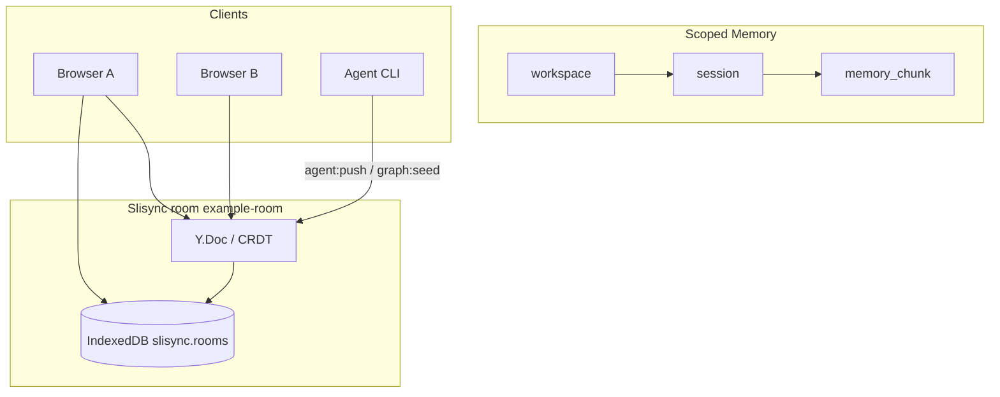

# Demo：以 Scoped Memory 为主

[English](../en/demo-scoped-memory.md)（默认）

本指南描述 **Slisync 参考 Demo** 的主路径：`workspace → session → memory_chunk` 在同一 room 内实时共编，并配合 Presence、Agent 与 Local-first。旧版 `message` / `counter` 字段已折叠为对比实验。

相关文档：[local-first.md](./local-first.md) · [export.md](./export.md) · [task-bus.md](./task-bus.md)（协作任务）· [ROADMAP.md](./ROADMAP.md)

---

## 数据流



---

## 前置

- **Node ≥ 20.9**（推荐 `nvm use 20`，项目根目录有 `.nvmrc`）
- 终端 1：

```bash
cd /path/to/infra
nvm use 20
npm install
npm run dev
```

- 等待终端出现 `> Local: http://localhost:3000` 后再打开浏览器。
- 默认 room：`example-room`；默认 scope：`ws-demo` / `sess-demo`（与 `npm run graph:seed` 一致）。

---

## 5 分钟手动验收

| 步骤 | 操作 | 期望 |
|------|------|------|
| 1 | 打开 [http://localhost:3000](http://localhost:3000)，保持 **CRDT** | 首屏为「共享记忆 · Scoped Memory」；左侧图导航、右侧 chunk 编辑 |
| 2 | 等待 `connected` / `syncReady` | 空 room 时**自动**写入演示 workspace/session/chunk（每浏览器会话仅一次）；或点「初始化演示工作区」 |
| 3 | 在右侧修改某个 **memory_chunk** 的标题或内容 | 本页即时更新；ScopeBar 显示当前 workspace / session |
| 4 | 再开一浏览器窗口访问同一 URL | 约数秒内看到相同 chunk 内容；ScopeBar 显示「本 room 在线 2 人」 |
| 5 | 终端 2 执行下方 **agent:push** 命令 | 顶部与共享记忆区出现 Agent 活动提示；图/chunk 可能更新（若 push 含 graphOps） |
| 6 | DevTools → Network → **Offline**，改 chunk → 硬刷新 → 恢复网络 | 编辑仍在（见 [local-first.md](./local-first.md)）；可点「清除本 room 本地缓存」重置 |

**说明：** `message` / `counter` 在「旧版共享字段演示」折叠区内，仅作 LWW/补丁对比，不是主路径。

---

## CLI 与 Demo 对齐

在 **`npm run dev` 已运行** 的前提下，另开终端：

```bash
# 与 Demo 相同 scope（ws-demo / sess-demo）写入图
npm run graph:seed

# 模拟 Agent 写入（可改 message；若服务端策略允许也可带 graphOps）
npm run agent:push -- --action summarize --append " [from agent]"
```

Demo 页底部提供**复制**按钮，命令与上一致。`graph:seed` 使用与 UI 相同的 `buildScopedMemoryOps(AGENT_ID, "ws-demo", "sess-demo")`。

导出快照（**不**从 IndexedDB 读，follow-up）：

```bash
npm run export:chunks
```

详见 [export.md](./export.md)。

---

## UI 能力对照（Phase 0–3）

| Phase | Demo 行为 |
|-------|-----------|
| 0 | Memory Graph 置顶；legacy message/counter 默认折叠；LWW 在「高级」区 |
| 1 | Scope 下拉 + 双栏（图导航 / chunk 编辑） |
| 2 | 空 room 自动 seed；可关闭的欢迎条 |
| 3 | ScopeBar 在线人数；Agent/graph 中文 toast；共享记忆区内 Agent 高亮 |

---

## 协作任务（任务看板）

同一 Demo 的 **任务看板** Tab 与本文共享 room（默认 `example-room`）与 scope（`ws-demo` / `sess-demo`），任务为 Graph 上的 `kind: "task"` 节点，与 memory_chunk 并列而非替代。

- 5 分钟验收、`npm run task:seed`、`agent:push --task-title`：见 [task-bus.md](./task-bus.md)
- 记忆 Tab 与任务 Tab 可同时使用；Agent 活动以顶部 toast 与任务看板内提示为主，无需依赖底部折叠区 agentLog

---

## 故障排查

| 现象 | 处理 |
|------|------|
| 浏览器一直转圈 | 确认 `npm run dev` 已打印 `Listen on`；执行 `npm run dev:stop` 后重启；`node -v` 须为 v20.x |
| 无自动 seed | 同会话已 seed 过（`sessionStorage`）；或 room 内已有节点；可手动点「初始化演示工作区」 |
| 在线人数为 0 | 等待 Presence；需 `connected` 且至少一个客户端在 room |
| agent:push 失败 | 先 `npm run dev`；查看终端 `[agent:push]` 与页面连接错误条 |

---

## 相关链接

- [local-first.md](./local-first.md) — IndexedDB 持久化与清除缓存
- [export.md](./export.md) — memory_chunk 导出为青笺 Markdown
- [task-bus.md](./task-bus.md) — 协作任务看板与 CLI
- [VISION.md](./VISION.md) — 产品定位
- [packages/README.zh-CN.md](../../packages/README.zh-CN.md) — 协议与 API
