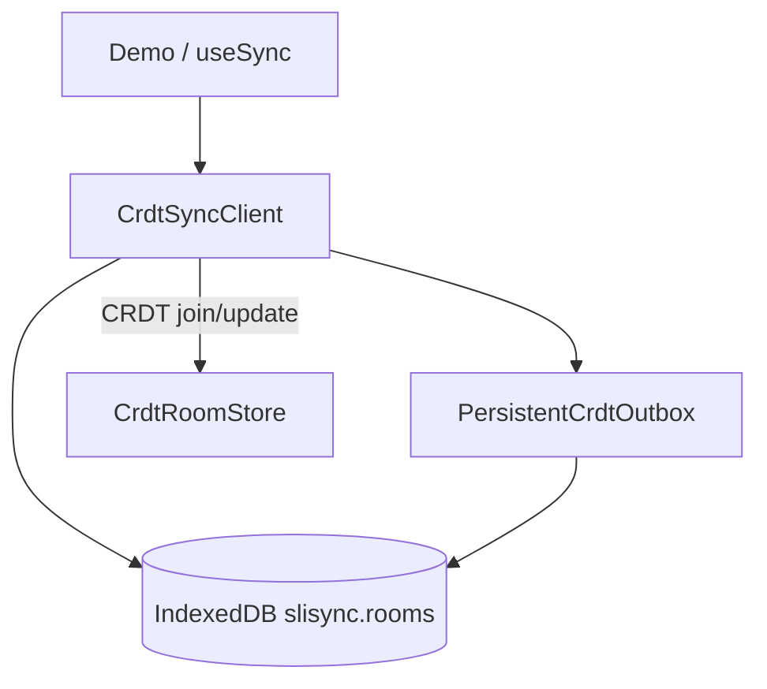

# Local-first 离线

[English](../en/local-first.md)

浏览器端为 CRDT room 提供 **IndexedDB 持久化**：刷新页面或短暂离线编辑后，先从本地恢复 `Y.Doc` 与待发送队列，联网后再与服务端 CRDT 合并。**服务端仍为合并权威。**

## 架构



## useSync 相关字段

```ts
const {
  patchData,
  outboxSize,
  localRestored,
  lastSyncedAt,
} = useSync({
  roomId: "example-room",
  defaultState: { message: "Hello", counter: 0 },
  strategy: "crdt",
  localPersistence: true,
});
```

| 字段 | 含义 |
|------|------|
| `localPersistence` | 是否使用 IndexedDB |
| `localRestored` | hydrate 前 `null`；曾应用本地快照为 `true` |
| `lastSyncedAt` | 上次与服务端成功同步（Unix ms） |
| `outboxSize` | 待上传队列长度 |

清除本地：`clearLocalRoom(roomId)`。

## 与导出的关系

::: warning
**export:chunks** 读取 **服务端** CRDT，不是 IndexedDB。仅本地未同步的编辑 **不会**出现在导出中。
:::

见 [导出 Markdown](./export.md)。
