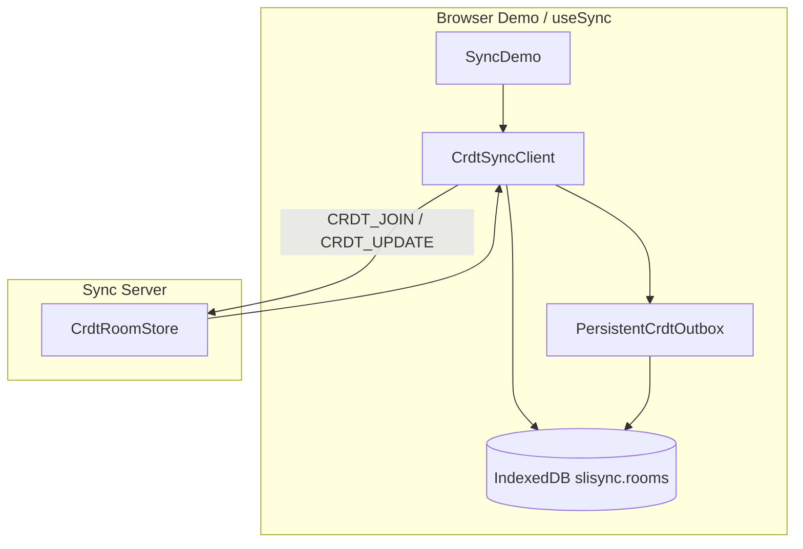

# Local-first（愿景 2）

[English](../en/local-first.md)（默认）

Slisync 正在为 CRDT room 增加**客户端持久化**，使房间状态与待发送更新在刷新页面或短暂离线编辑后仍可恢复。重连后仍以服务端 CRDT 为合并权威。

---

## 目标

| 主题 | 目标 |
|------|------|
| 愿景 2 | Local-first：IndexedDB、离线队列、联网后回放 |
| 工程 | 在 **P2-9**（CRDT outbox + 重连 flush）之上增加持久化 |

浏览器端默认开启：刷新或断网编辑后，先从 IndexedDB 恢复 `Y.Doc` 与 outbox，联网再与服务端 CRDT 合并。

---

## 架构（Phase 3–5）



---

## `RoomLocalRecord`（schema v1）

按 `roomId` 存入 IndexedDB 的 `rooms` object store（库名 `slisync`，version `1` — Phase 1 实现）。

| 字段 | 类型 | 含义 |
|------|------|------|
| `schemaVersion` | `1` | 迁移版本号 |
| `roomId` | string | 房间键 |
| `strategy` | `"crdt"` | v1 不持久化 LWW |
| `docSnapshot` | string (base64) | `Y.encodeStateAsUpdate(doc)` |
| `outbox` | `string[]` | 待上传的 FIFO base64 增量更新 |
| `clientId` | `string \| null` | 跨会话稳定的客户端 id |
| `lastSyncedAt` | `number \| null` | 上次成功与服务端同步（Unix ms） |
| `updatedAt` | `number` | 上次本地写入（Unix ms） |

类型见 `@slisync/sync-sdk`：`RoomLocalRecord`、`isRoomLocalRecord`、`LocalRoomStore`、`CrdtOutbox`。

---

## IndexedDB schema（Phase 1）

| 项 | 值 |
|----|-----|
| 数据库 | `slisync` |
| 版本 | `1` |
| Object store | `rooms` |
| 主键 | `roomId` |
| 值 | `RoomLocalRecord`（structured clone） |

### `LocalRoomStore` API

| 方法 | 行为 |
|------|------|
| `get(roomId)` | 返回记录；缺失或 schema 无效时返回 `null` |
| `put(record)` | 校验记录，`updatedAt` 设为当前时间并 upsert |
| `delete(roomId)` | 删除记录 |
| `listRoomIds()` | 列出 `rooms` 中全部 key |

工厂函数：

- `createIndexedDBRoomStore()` — 浏览器；无 IndexedDB 时抛错
- `createNoopLocalRoomStore()` — 内存 `Map`，供 Node 测试与 `localPersistence: false`
- `isIndexedDBAvailable()` — 能力检测

配额：`put` 在存储满时可能抛出 `LocalRoomQuotaExceededError`。

### Outbox API（Phase 2）

| 导出 | 作用 |
|------|------|
| `InMemoryCrdtOutbox` | 内存 FIFO 队列 |
| `CrdtUpdateOutbox` | `InMemoryCrdtOutbox` 别名（兼容旧代码） |
| `PersistentCrdtOutbox` | 内存队列 + debounce 写入 `LocalRoomStore.outbox` |
| `createCrdtOutbox({ roomId, persistence })` | `false` 仅内存；`true` 用 IDB 或 noop；可注入 store |
| `clearLocalRoom(roomId)` | 删除该 room 的本地记录 |
| `useSync({ localPersistence })` | 传给 `CrdtSyncClient`（浏览器默认开启） |

### 客户端生命周期（Phase 3）

1. `connect()` → 读取 `RoomLocalRecord` → 应用 `docSnapshot` → hydrate `outbox` → Socket `CRDT_JOIN`
2. 本地编辑 → 未 synced 时 debounce 写 `docSnapshot` + outbox 入队
3. `markSynced` → flush outbox → 写入 `lastSyncedAt` 并清空持久化 outbox
4. `disconnect()` → 写快照（**不会**清空内存中的 outbox 队列）

---

## IndexedDB 选型

**Phase 0–1：** 使用原生 `indexedDB` API（不新增依赖）。  
仅当升级/迁移代码过于复杂时再评估 [`idb`](https://github.com/jakearchibald/idb) 封装。

**Phase 0：** 仅类型 + `LocalRoomStore` + 内存版 `createNoopLocalRoomStore()`，**不改变** `CrdtSyncClient`。

**Phase 1：** `createIndexedDBRoomStore()` + 单元测试（`fake-indexeddb` 仅 dev）。

---

## 分阶段计划

| Phase | 交付 |
|-------|------|
| **0** ✅ | `RoomLocalRecord`、`LocalRoomStore`、`CrdtOutbox` 类型与文档 |
| **1** ✅ | `createIndexedDBRoomStore()` + `tests/unit/indexeddb-room-store.test.ts` |
| **2** ✅ | `PersistentCrdtOutbox`、`createCrdtOutbox()`、`InMemoryCrdtOutbox` |
| **3** ✅ | `CrdtSyncClient` hydrate + 快照持久化；`useSync({ localPersistence })` |
| **4** ✅ | 集成测试（IndexedDB 刷新 / outbox flush） |
| **5** ✅ | Demo 显示本地状态 / 清除缓存；ROADMAP 愿景 2 ✅ |

**后续：** 从本地存储导出 chunks；多 Tab 协调。

---

## 手动验收（Demo）

1. `npm run dev`，打开 [http://localhost:3000](http://localhost:3000)，选择 **CRDT**。
2. 修改 **Message** 或添加 Memory Graph chunk，等待状态为 `connected` 且「上次同步」有时间戳。
3. 打开 DevTools → **Network** → **Offline**，再改 Message。
4. **硬刷新**页面（Cmd+R / F5）。
5. 恢复网络：离线编辑仍在；「离线队列」最终归零；另一浏览器窗口可看到合并结果。
6. 点击 **清除本 room 本地缓存**，刷新后「本地状态」应为 **无本地数据**。

---

## 故障排查

| 现象 | 处理 |
|------|------|
| `QuotaExceededError` / 写入失败 | 浏览器存储已满；Demo 点「清除本 room 本地缓存」，或 DevTools → Application → IndexedDB → 删除 `slisync` |
| 刷新后仍是默认文案 | 确认策略为 CRDT；未点清除缓存；无痕模式每次无本地数据属正常 |
| 离线队列一直不归零 | 检查 sync 端点是否可达；查看红色连接错误条 |
| 与服务端内容不一致 | 服务端 CRDT 为合并权威；本地未 flush 的 outbox 会在 `syncReady` 后上传 |

---

## 测试（Phase 4）

需要 **Node ≥ 20.9**。

```bash
# 全量（含 local-first 单元与集成）
npm test

# 仅 IndexedDB 集成
npx tsx --test tests/integration/crdt-indexeddb-persistence.test.ts

# 仅 local-first 单元
npx tsx --test tests/unit/indexeddb-room-store.test.ts \
  tests/unit/persistent-crdt-outbox.test.ts \
  tests/unit/merge-local-remote.test.ts
```

| 文件 | 用例 |
|------|------|
| `tests/unit/indexeddb-room-store.test.ts` | IDB put/get/delete、错误 schema |
| `tests/unit/persistent-crdt-outbox.test.ts` | debounce 持久化、drain 清空 |
| `tests/unit/merge-local-remote.test.ts` | `applyServerSnapshotToDoc` |
| `tests/integration/crdt-local-persistence.test.ts` | noop store hydrate、断开重连 |
| `tests/integration/crdt-indexeddb-persistence.test.ts` | **A** IDB 预置 outbox → 新实例 join flush → 读者收到；**B** flush 后 IDB `outbox` 为空 |

Node 集成测试使用 devDependency `fake-indexeddb`（文件顶部 `import "fake-indexeddb/auto"`）。  
`npm run test:cluster` 不依赖 IndexedDB。

CI：`.github/workflows/ci.yml` 已执行 `npm test`（`--test-concurrency=1`，避免 fake-indexeddb 并行竞态）。

---

## 相关文档

- [ROADMAP.md](./ROADMAP.md) — 愿景 2 状态
- [VISION.md](./VISION.md) — 产品原则
- [packages/README.zh-CN.md](../../packages/README.zh-CN.md) — SDK API
