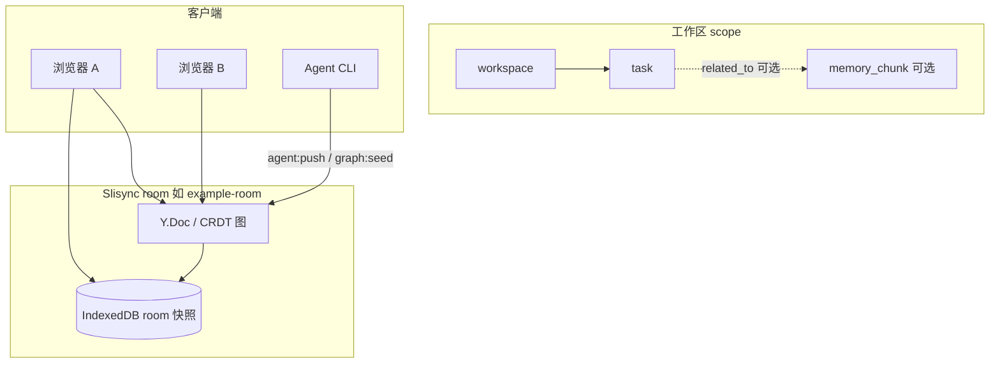

# Room 任务总线（Phase 0）

[English](../en/task-bus.md)（默认）

本文定义 Slisync **room 级、图原生（graph-native）** 的任务模型：权威任务状态存放在共享 Memory Graph 的 `kind: "task"` 节点中，**不**使用独立的 IndexedDB 任务表，本阶段也**不**新增 socket 事件。

相关：[demo-scoped-memory.md](./demo-scoped-memory.md) · [local-first.md](./local-first.md) · [packages/README.zh-CN.md](../../packages/README.zh-CN.md)

---

## 数据流



任务与 scoped memory 一样，是 **CRDT 图上的节点**。客户端与 Agent 通过既有图操作（`upsertNode`、`upsertEdge`）在 `agent:push` 或 room CRDT 更新中写入 — Phase 0 **没有** `sync:task-*` socket 事件。

---

## 任务 vs Scoped Memory

| 维度 | `memory_chunk`（scoped memory） | `task`（任务总线） |
|------|--------------------------------|-------------------|
| 用途 | 工作区/会话下的 AI/用户记忆片段 | 可执行工作项（状态、负责人、截止） |
| `data` 核心 | `content`、`importance`、`scope` | `status`、`scope`，可选 `assigneeId`、`priority`、`dueAt` |
| 典型边 | 自 session `contains` | `depends_on`、`assigned_to`，可选 `related_to` → chunk |
| 解析 | `parseMemoryChunkData` | `parseTaskData` |

任务可通过 **`related_to`** 关联到 memory chunk：正文留在 chunk，任务跟踪执行状态（Phase 0 仅文档化；`MemoryGraph.upsertTask` 在 Phase 1 提供）。

---

## `TaskData`（schema）

类型位于 `@slisync/sync-schema`（`task-model.ts`）：

| 字段 | 类型 | 必填 |
|------|------|------|
| `scope` | `MemoryScope`（`workspaceId`，可选 `sessionId`） | 是 |
| `status` | `todo` \| `in_progress` \| `blocked` \| `done` \| `cancelled` | 是 |
| `assigneeId` | string | 否 |
| `priority` | number | 否 |
| `dueAt` | ISO-8601 字符串 | 否 |
| `source` | string（如 `agent:push`） | 否 |

节点示例：

```json
{
  "kind": "task",
  "title": "审查 scoped memory 导出",
  "data": {
    "scope": { "workspaceId": "ws-demo", "sessionId": "sess-demo" },
    "status": "todo",
    "priority": 1,
    "source": "agent:push"
  }
}
```

---

## Agent 图策略（默认）

`DEFAULT_AGENT_GRAPH_POLICY` 默认允许：

- **节点种类：** 含 `task`
- **关系：** 含 `depends_on`、`assigned_to`（以及 `contains`、`related_to` 等）
- **操作：** `upsertNode`、`upsertEdge`、`addTag`、`addRef`

查看摘要：

```bash
npm run graph:policy
```

---

## CLI（协议未变）

在 `npm run dev` 已运行的前提下：

```bash
npm run graph:seed
npm run agent:push -- --action summarize --append " [from agent]"
```

Scoped memory 种子流程见 [demo-scoped-memory.md](./demo-scoped-memory.md)。后续阶段将通过同一条 graph op 路径写入任务节点；Phase 0 仅交付类型、解析器与策略默认值。

---

## Phase 0 范围

| 包含 | 不包含 |
|------|--------|
| `TaskStatus`、`TaskData`、`parseTaskData` | `MemoryGraph.upsertTask` 辅助方法 |
| 中英文设计文档（本文） | Demo 任务 UI |
| Agent 默认策略（`task` / `depends_on` / `assigned_to`） | `sync:task-*` socket 事件 |
| 解析单元测试 | 仅 IndexedDB 的任务表 |

---

## 相关链接

- [demo-scoped-memory.md](./demo-scoped-memory.md) — workspace → session → memory_chunk 演示
- [local-first.md](./local-first.md) — CRDT + IndexedDB room 持久化（非任务库）
- [ROADMAP.md](./ROADMAP.md) — 阶段规划
