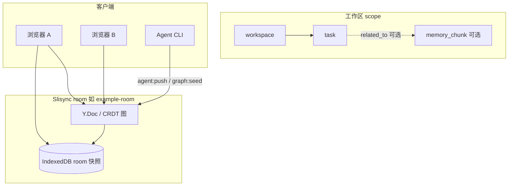

# Room 任务总线（Phase 0）

[English](../en/task-bus.md)（默认）

本文定义 Slisync **room 级、图原生（graph-native）** 的任务模型：权威任务状态存放在共享 Memory Graph 的 `kind: "task"` 节点中，**不**使用独立的 IndexedDB 任务表，本阶段也**不**新增 socket 事件。

相关：[demo-scoped-memory.md](./demo-scoped-memory.md) · [local-first.md](./local-first.md) · [packages/README.zh-CN.md](../../packages/README.zh-CN.md)

---

## 数据流



任务与 scoped memory 一样，是 **CRDT 图上的节点**。客户端与 Agent 通过既有图操作（`upsertNode`、`upsertEdge`）在 `agent:push` 或 room CRDT 更新中写入 — Phase 0 **没有** `sync:task-*` socket 事件。

---

## 任务 vs Scoped Memory

| 维度 | `memory_chunk`（scoped memory） | `task`（任务总线） |
|------|--------------------------------|-------------------|
| 用途 | 工作区/会话下的 AI/用户记忆片段 | 可执行工作项（状态、负责人、截止） |
| `data` 核心 | `content`、`importance`、`scope` | `status`、`scope`，可选 `assigneeId`、`priority`、`dueAt` |
| 典型边 | 自 session `contains` | `depends_on`、`assigned_to`，可选 `related_to` → chunk |
| 解析 | `parseMemoryChunkData` | `parseTaskData` |

任务可通过 **`related_to`** 关联到 memory chunk：正文留在 chunk，任务跟踪执行状态。

---

## `TaskData`（schema）

类型位于 `@slisync/sync-schema`（`task-model.ts`）：

| 字段 | 类型 | 必填 |
|------|------|------|
| `scope` | `MemoryScope`（`workspaceId`，可选 `sessionId`） | 是 |
| `status` | `todo` \| `in_progress` \| `blocked` \| `done` \| `cancelled` | 是 |
| `assigneeId` | string | 否 |
| `priority` | number | 否 |
| `dueAt` | ISO-8601 字符串 | 否 |
| `source` | string（如 `agent:push`） | 否 |

节点示例：

```json
{
  "kind": "task",
  "title": "审查 scoped memory 导出",
  "data": {
    "scope": { "workspaceId": "ws-demo", "sessionId": "sess-demo" },
    "status": "todo",
    "priority": 1,
    "source": "agent:push"
  }
}
```

---

## SDK（Phase 1）

从 `@slisync/sync-sdk` / `@slisync/sync-sdk/graph` 导出：

| API | 作用 |
|-----|------|
| `MemoryGraph.upsertTask` | 在 room 的 `Y.Doc` 上创建/更新 `kind: "task"` 节点 |
| `MemoryGraph.updateTaskStatus` | 修改已有任务的 `status` 及可选字段 |
| `filterTasksByScope` | 按 `workspaceId` / `sessionId` 筛出任务节点 |
| `buildDemoTaskOps` | 种子 GraphOp：workspace/session + 3 条中文演示任务 + `contains` / `depends_on` / `assigned_to` |

```ts
import * as Y from "yjs";
import {
  applyGraphOps,
  buildDemoTaskOps,
  filterTasksByScope,
  MemoryGraph,
  readMemoryGraphSnapshot,
} from "@slisync/sync-sdk/graph";

const doc = new Y.Doc();
const graph = MemoryGraph.on(doc, "agent-1").init("room-graph");

const task = graph.upsertTask({
  workspaceId: "ws-demo",
  sessionId: "sess-demo",
  title: "审查导出流水线",
  status: "todo",
  priority: 1,
});

graph.updateTaskStatus(task.id, "in_progress", { assigneeId: "user-42" });

applyGraphOps(doc, buildDemoTaskOps("agent-1", "ws-demo", "sess-demo"), "agent-1");
const snap = readMemoryGraphSnapshot(doc);
const tasks = filterTasksByScope(snap?.nodes ?? [], {
  workspaceId: "ws-demo",
  sessionId: "sess-demo",
});
```

类型：`UpsertTaskInput`、`UpdateTaskPatch`；解析：`parseTaskData`（`@slisync/sync-schema`）。

---

## Agent 图策略（默认）

`DEFAULT_AGENT_GRAPH_POLICY` 默认允许：

- **节点种类：** 含 `task`
- **关系：** 含 `depends_on`、`assigned_to`（以及 `contains`、`related_to` 等）
- **操作：** `upsertNode`、`upsertEdge`、`addTag`、`addRef`

查看摘要：

```bash
npm run graph:policy
```

---

## CLI（Phase 2）

终端 1：

```bash
npm run dev
```

终端 2 — 可选，先写入 scoped memory（workspace/session 节点）：

```bash
npm run graph:seed
```

向 `example-room` 种子演示任务（`ws-demo` / `sess-demo`）：

```bash
npm run task:seed
```

期望输出：`[task:seed] ok room=example-room ...`

按标题 upsert 单条任务（稳定 node id，与 agent push 同路径）：

```bash
npm run agent:push -- --task-title "审查导出流水线" --status in_progress
```

旧版 message 补丁（不变）：

```bash
npm run agent:push -- --action summarize --append " [from agent]"
```

环境变量与 `graph:seed` 相同：`SYNC_URL`、`SYNC_ROOM`、`SYNC_AGENT_ID`。覆盖策略时见 `.env.example` 中 `SYNC_AGENT_GRAPH_KINDS`（须含 `task`）。

### 策略拒绝（手动验收）

服务端限制 kinds（不含 `task`）时，`npm run task:seed` 应失败并返回可读错误，例如 `node kind not allowed: task`。

---

## 交付阶段

| 阶段 | 包含 | 不包含 |
|------|------|--------|
| 0 | `TaskData`、`parseTaskData`、策略默认、设计文档 | SDK 辅助方法、Demo UI |
| 1 | `upsertTask`、`updateTaskStatus`、`filterTasksByScope`、`buildDemoTaskOps` | Demo UI、`sync:task-*` 事件 |
| 2 | `task:seed` CLI、服务端策略默认、`agent:push --task-title` | Demo UI、`sync:task-*` 事件 |
| 3+ | Demo / 活动流集成（规划） | 仅 IndexedDB 的任务表 |

---

## 相关链接

- [demo-scoped-memory.md](./demo-scoped-memory.md) — workspace → session → memory_chunk 演示
- [local-first.md](./local-first.md) — CRDT + IndexedDB room 持久化（非任务库）
- [ROADMAP.md](./ROADMAP.md) — 阶段规划
